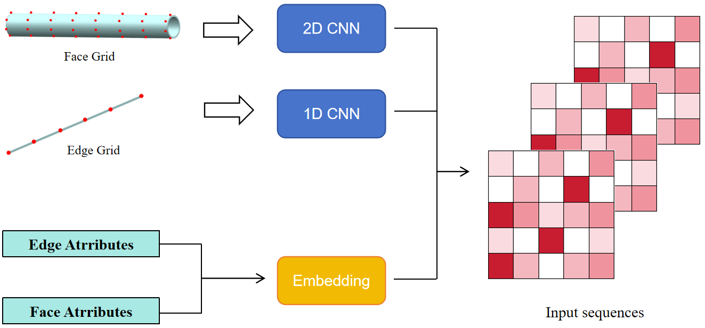
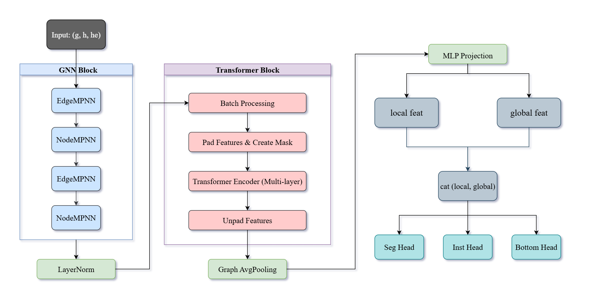

# TGNet
Code for “TGNet: A Graph Neural and Transformer Network for Multi-Task Machining Feature Recognition in B-rep CAD Models”

## Abstract
In Computer-Aided Process Planning (CAPP), machining feature recognition (MFR) helps to automatically identify manufacturing features from 3D CAD models. Rule-based and traditional machine learning methods often have difficulty handling complex feature interactions and generalization. In contrast, recent advances in deep learning have led to more robust and effective solutions. In this paper, we propose TGNet, a neural network combining graph neural networks for local feature extraction with a Transformer module for global context modeling. It efficiently processes B-rep data by unifying geometric sampling, attribute embedding, and hierarchical feature fusion. TGNet is designed as a multi-task network that enables precise recognition and localization of machining features and related surfaces, providing essential support for downstream operations such as part dimension measurement. To evaluate TGNet, we construct two fully-annotated datasets for piping and sheet metal, covering a wide range of manufacturing features. Experimental results demonstrate that TGNet delivers strong performance on various tasks, showing great potential for real-world industrial applications.




## Environment Setup
```bash
conda env create -f environment.yaml -n XXX  # Replace XXX with your environment name
conda activate XXX
```
## Dataset
Download the piping and sheet metal dataset from the following link:
https://drive.google.com/drive/folders/1TevFvOuHBV50hqkWHwlLMgEiZvSA9XwX?usp=drive_link 

make sure each dataset contains these folders: fag, labels, MFInstseg_partition, steps.

## Train
Open [dataprocess.py](Code/dataprocess.py) and choose according to the dataset type:
```bash
Line 21 # return 17  # steel metal
Line 22 # return 13  # piping
```
Then Open [train.py](Code/train.py) and change the dataset path to your local dataset path:
```bash
Line 62 "dataset": "D:\\dataset\\sheet metal dataset"  # Path containing 'fag', 'labels', 'MFInstseg_partition', and 'steps'
```
Finally, run: 
```bash
python train.py
```
After training starts, all logs and models will be saved automatically (the `output` folder will be created in the same directory where you run `train.py`):
- Logs: `output/<timestamp>/log.txt`
- Model checkpoints: `output/<timestamp>/weight_xx-epoch.pth`
- Best model: `output/<timestamp>/best_model.pth`

(Additionally, offline wandb logs will be stored in the `wandb/` folder.)

## Test
Open [test.py](Code/test.py) and change the dataset and weight path:
```bash
Line 57 "dataset": "D:\\dataset\\sheet metal dataset",  # Path containing 'fag', 'labels', 'MFInstseg_partition', and 'steps'
Line 98 model_param = torch.load("E:/TGNet/Code/output/2025_03_11_17_52_06/weight_27-epoch.pth", map_location=device)
```
Then run: 
```bash
python test.py
```
The script will run testing and print the evaluation metrics for the three tasks together with the overall loss value.
